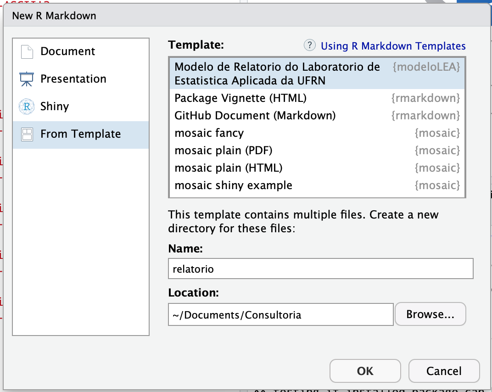

## modeloLEA

Este pacote do `R` utiliza rmarkdown para criar relatórios mesclando `R` e LaTeX.

Rode o comando

    install.packages("devtools")
    
para instalar o pacote `devtools`, resposnsável pela instalação do pacote `modeloLEA`. Em seguida, execute os comandos

    library(devtools)
    install_github("mnunes/modeloLEA")

para instalar o pacote `modeloLEA`. Se o R Markdown nunca foi utilizado em computador, é possível que alguns pacotes extras tenham que ser baixados. Seja paciente.

Embora o pacote já esteja instalado, ele não vai funcionar se não houver uma distribuição do LaTeX em seu computador. A Seção _Instalação do LaTeX_, logo abaixo, mostra como instalar o [TinyTeX](https://yihui.name/tinytex/) em seu computador. Esta distribuição do LaTeX foi pensada especialmente para uuários do `R`, de modo que fosse o menor possível e, ainda assim, completa o suficiente para a produção de relatórios de pesquisa.

Perceba que esta é uma versão preliminar do modelo de relatório. É possível (bastante provável, na verdade) que hajam alguns bugs. Entre em contato pelo email marcus [arroba] marcusnunes.me para me avisar a respeito de qualquer bug ou problema de instalação ou uso.

O arquivo [modeloLEA_rascunho.pdf](https://github.com/mnunes/modeloLEA/blob/master/modeloLEA_rascunho.pdf) exibe o resultado esperado para o rascunho do relatório, que deve ser avaliado pelo professor orientador. O arquivo [modeloLEA_final.pdf](https://github.com/mnunes/modeloLEA/blob/master/modeloLEA_final.pdf) exibe o resultado esperado para o relatório final, a ser entregue ao consulente.

## Requisitos do Sistema

Para rodar os exemplos disponíveis neste repositório, é necessário instalar os seguintes programas em seu computador:

- LaTeX (o MikTeX, versão 2.9 ou superior, versão completa, é o mais usado no Windows. Entretanto, veja abaixo, na Seção _Instalação do LaTeX_, como fazer para instalar uma versão mais simples do LaTeX, a partir do próprio `R`)

- `R` (versão 3.4.3 ou superior) - [link](https://cran.rstudio.com/)

- RStudio (versão 1.1.423 ou superior) - [link](https://www.rstudio.com/products/rstudio/download/#download)

É possível que o pacote funcione em outras configurações, mas estas são aquelas em que ele foi testado.

## Instalação do LaTeX

Em vez de instalar o MikTeX em seu computador, sugiro que o [TinyTeX](https://yihui.name/tinytex/) seja instalado. Ele possui uma série de vantagens:

* É mais leve do que o MikTeX
* É baseado no Tex Live, versão do LaTeX que pessoalmente utilizo há mais de 10 anos
* Pode ser instalado de dentro do `R`
* Foi desenvolvido pelo criador do `knitr`, o pacote do `R` utilizado para criar os documentos de forma dinâmica
* Funciona em todas as plataformas (Windows, Linux, macOS)
* A manutenção é mais simples

A instalação do TinyTeX é simples. Se o pacote `devtools` estiver instalado em seu computador, rode os comandos

    library(devtools)
    install_github(c("yihui/tinytex", "rstudio/rmarkdown"))
    tinytex::install_tinytex()

Vão aparecer um aviso e duas mensagens de erro durante a execução do segundo comando. Ignore-as dando OK no prompt que aparecer e pronto. Após os procedimentos necessários, seu computador vai estar com o LaTeX instalado.

Feche e abra o RStudio antes de compilar o relatório pela primeira vez.

## Utilização do pacote

Após o pacote ser instalado, clique no menu `File > New File > R Markdown...`. Veja na figura abaixo como fazer isto.

Uma tela de diálogo aparecerá. Escolha a opção Modelo LEA (PDF) dentro da guia From Template. Veja na figura abaixo como fazer isto.

Esta sequência de comandos criará uma pasta nova em seu computador. Esta pasta pode ter qualquer nome. No exemplo acima, o nome da pasta criada é `relatorio`. Esta pasta vai conter todos os arquivos necessários para a escrita do relatório de consultoria. Se houver algum problema com os acentos das palavras, vá ao menu `File > Reopen With Encoding...` e escolha a opção Windows 1252.

Basta editar os arquivos `relatorio.Rmd` e `modeloLEA.bib` para produzir seu texto. O arquivo `relatorio.Rmd` contém o relatório em si, enquanto o arquivo `modeloLEA.bib` possui as referências bibliográficas. A compilação do relatório é feita através da combinação de teclas `Ctrl + Shift + K`.

A primeira compilação do relatório será um pouco demorada. A instalação padrão do TinyTeX não possui alguns dos pacotes exigidos pelo modelo do relatório, então tenha paciência. As compilações seguintes serão muito mais rápidas.

Lembre-se que esta é uma versão preliminar deste modelo de relatório. É possível que ainda hajam alguns bugs. Entre em contato pelo email marcus [arroba] marcusnunes.me para me avisar a respeito de qualquer problema.

## Opções do Relatório

A primeira versão do arquivo é criada com duas opções específicas. A opção `watermark: true` colocará uma marca d'água intitulada RASCUNHO no documento compilado. Esta marca d'água pode ser retirada alterando esta opção para `watermark: false`.

Também por padrão, a opção `echo=TRUE`, na linha 71, vai exibir o código do `R` utilizado na análise. Quando a versão final do relatório ficar pronta, basta alterar esta opção para `echo=FALSE`, de modo que apenas o resultado do código executado apareça na versão final do relatório.

Por fim, após a compilação é gerada uma pasta chamada `relatorio_files`, que contém pdfs de alta resolução de todas as figuras do relatório. Assim, estas figuras podem ser, posteriormente, entregues ao consulente.

Este pacote foi inspirado pelo [pinp](https://github.com/eddelbuettel/pinp). 