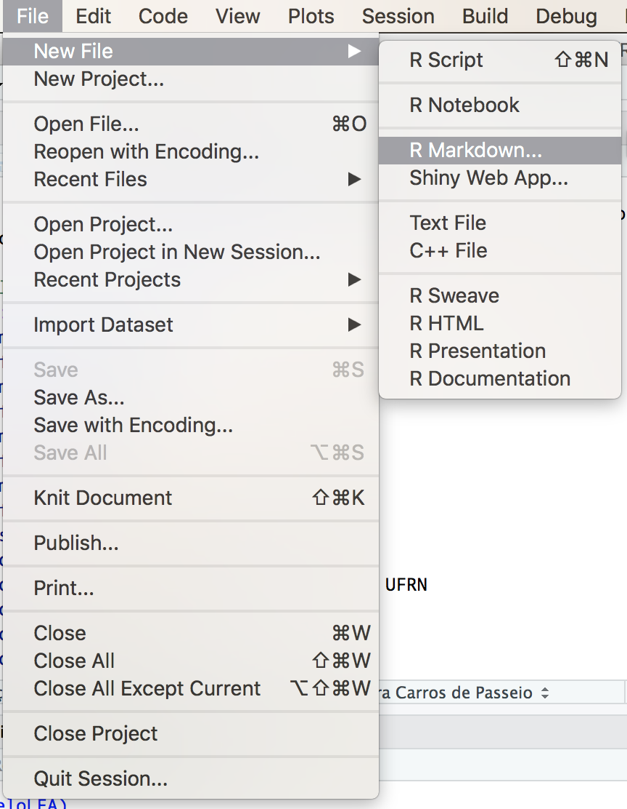

## modeloLEA

Este pacote do `R` utiliza rmarkdown para criar relatórios mesclando `R` e LaTeX.

Rode o comando

    devtools::install_github("mnunes/modeloLEA")

para instalar o pacote. Se não funcionar, primeiro instale o pacote `devtools` através do comando

    install.packages("devtools")

Esta é uma versão preliminar deste modelo de relatório. É possível que hajam alguns bugs. Entre em contato pelo email marcus [arroba] marcusnunes.me para me avisar a respeito de qualquer problema.

O arquivo [modeloLEA.pdf](https://github.com/mnunes/modeloLEA/blob/master/modeloLEA.pdf) exibe o resultado esperado pelo modelo.

## Requisitos do Sistema

Para rodar os exemplos disponíveis neste repositório, é necessário instalar os seguintes programas em seu computador:

- MikTex (versão 2.9 ou superior)

- R (versão 3.4.3 ou superior)

- RStudio (versão 1.1.383 ou superior)

## Utilização do pacote

Após o pacote ser instalado, feche e abra o RStudio. Carregue o pacote `modeloLEA` na memória do `R` através do comando `library(modeloLEA)`. Desta forma, ao clicar no menu File > New File > R Markdown..., aparecerá a opção Modelo LEA (PDF) dentro da guia From Template. Acompanhe as figuras abaixo para uma explicação visual.

Esta sequência de comandos criará uma pasta nova em seu computador. Esta pasta terá o nome que você quiser. No exemplo acima, o nome da pasta criada é `relatorio`. Esta pasta vai conter todos os arquivos necessários para a escrita do relatório de consultoria. Basta editar os arquivos `relatorio.Rmd` e `modeloLEA.bib` para produzir seu texto. A compilação do relatório é feita através da combinação de teclas `Ctrl + Shift + K`.

## Opções do Relatório

A primeira versão do arquivo é criada com duas opções específicas. A opção `watermark: true` colocará uma marca d'água intitulada RASCUNHO no documento compilado. Esta marca d'água pode ser retirada alterando esta opção para `watermark: false`.

Também por padrão, a opção `echo=TRUE`, na linha 72, vai exibir o código do `R` utilizado na análise. Quando a versão final do relatório ficar pronta, basta alterar esta opção para `echo=FALSE`, de modo que apenas o resultado do código executado apareça na versão final do relatório.

Por fim, após a compilação é gerada uma pasta chamada `relatorio_files`, que contém pdfs de alta resolução de todas as figuras do relatório. Assim, estas figuras podem ser, posteriormente, entregues ao consulente.

Este pacote foi fortemente inspirado pelo [pinp](https://github.com/eddelbuettel/pinp). 